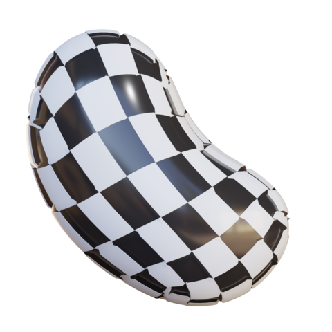
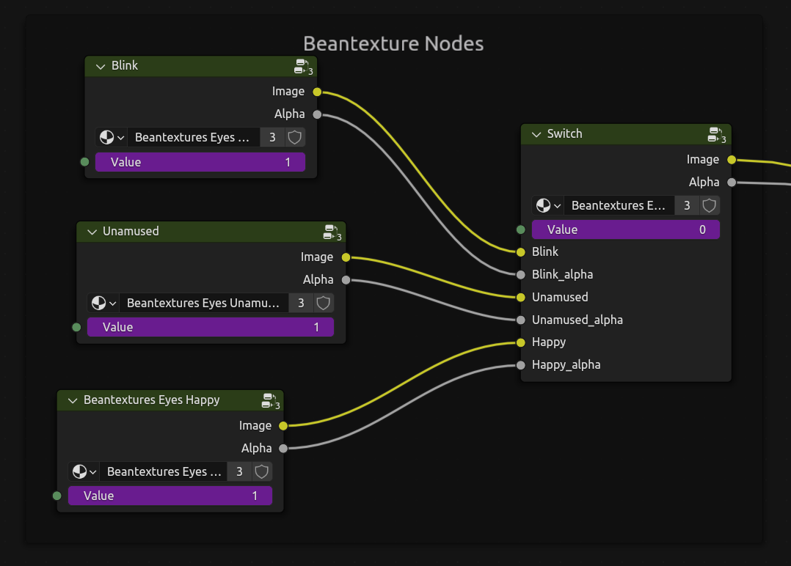
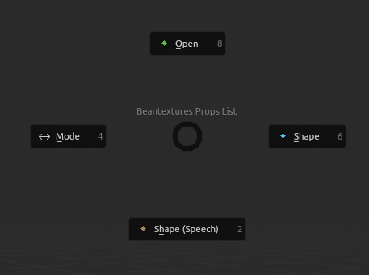
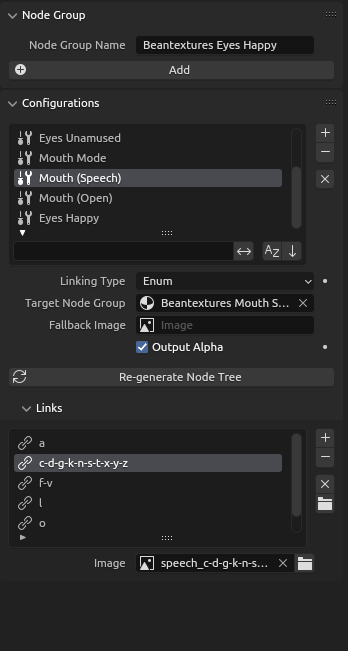

    <h1>Beantextures</h1>
    
<i>2D texture switch node generation + on-pose mode controls</i>

    

<a href="daringcuteseal.gumroad.com/l/beantextures">Get now!</a> &bull;
<a href="https://github.com/BeanwareHQ/beantextures/wiki">Wiki</a> &bull;
<a href="https://github.com/BeanwareHQ/beantextures/wiki/Quick-Start-Guide">Quick Start</a>

# Overview

Beantextures does two things: **generate image switching shader node group(s)** and then **expose the image index property in pose mode**—no more than that. You still get to set up your rig the way you want it to be!

Here's an example of a practical usage: ([you can get the model here](assets/been-model.zip))

https://github.com/user-attachments/assets/1033d1a8-2745-4470-bb34-b10200795a30

# Why Beantextures?

Well, it automates the actual switch node generation, with the best^[most flexible but not that performant; shouldn't be too much of an issue for most rig setups.] approach to 2D image-switching animation (mix nodes)!

At least that's it for the node group generator. But whether the node properties controller makes your life simpler or not is totally subjective; at least it does for me. The Bean rig setup I made previously was done in just 2 days; it may take longer if I have to rely solely on drivers (the common approach).

# Features

<b>Node Generation</b>

- Supports 4 image indexing types: standard **single integers**, **ranged integers**, **ranged floats**, and most importantly, **enums!** (a.k.a dropdown items)
- Output alpha channel of the active image
- Specify a fallback image when the index doesn't correspond to any image texture

# To-Do's

