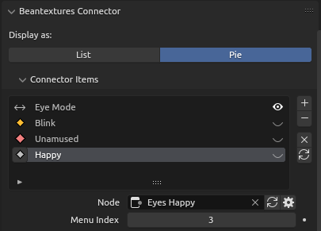

    <h1>Beantextures</h1>
    
<i>2D texture switch node generation + controls in pose mode</i>

    

<a href="https://github.com/BeanwareHQ/beantextures/wiki/Installation">Get it!</a> &bull;
<a href="https://github.com/BeanwareHQ/beantextures/wiki">Wiki</a> &bull;
<a href="https://github.com/BeanwareHQ/beantextures/wiki/Quick-Start-Guide">Quick Start</a>

# Great News!
Beantextures is now [available at the official extensions marketplace](https://extensions.blender.org/add-ons/beantextures/). Simply open Blender and search for it to get started!

# Overview

Beantextures does two things: **generate image switching shader node group(s)** and then **expose the image index property in pose mode**—no more than that. You still get to set up your rig the way you want it to be!

https://github.com/user-attachments/assets/38db8269-aa31-47b1-ae58-f3462eb62e1a

Here's an example of a more practical usage: ([you can get the model here](assets/been-model.zip))

https://github.com/user-attachments/assets/1033d1a8-2745-4470-bb34-b10200795a30

# Compatibility
Beantextures is only compatible with Blender &ge;4.0.
# Why Beantextures?

Well, it automates the actual switch node generation, with the best[^1] approach to 2D image-switching animation (mix nodes)!

At least that's it for the node group generator. But whether the node properties controller makes your life simpler or not is totally subjective; at least it does for me. The Bean rig setup I made previously was done in just 2 days; it may take longer if I have to rely solely on drivers (the common approach).

# Features

<b>Node Generation</b>

- 🖼️ Supports 4 image indexing types: standard **single integers**, **ranged integers**, **ranged floats**, and most importantly, **enums!** (a.k.a dropdown items)
- ⬛ Output alpha channel of the active image
- ❓ Specify a fallback image when the index doesn't correspond to any image texture

<b>Pose Mode Properties Display</b>

    
    

- 📑 Choose between Pie menu/list pop-up
- 🌀 Custom icons for each item
- 🏷️ Sort the order of properties as you wish

# Contributing
See [CONTRIBUTING.md](CONTRIBUTING.md).

# Thanks

- Original icon picker code: https://projects.blender.org/blender/blender-addons/src/branch/main/development_icon_get.py
- [Labirhin](https://www.instagram.com/labirhin/), whose work became my main inspiration for writing this add-on.

[^1]: Based on my research, the approach this add-on uses is the most future-proof and flexible one—not the absolute fastest one, though. You can read my devlog(s) for more information: https://daringcuteseal.github.io/blog/beantextures-devlog-2/
